**Procedural Forest System Documentation:**

Quick Start

1.  Connect a HeightField terrain as the terrain input.

> The system uses the terrain to calculate height and slope information
> for vegetation distribution.

2.  Assign the vegetation geometries through the exposed parameters:

- Tree Instances

- Bush Instances

- Grass Instances

3.  Adjust the Terrain parameters as needed:

- Global Seed

- Custom Mask Mode

- Add / Remove Mask controls

- Height and Slope settings

4.  Use the Trees, Bushes, and Grass parameter groups to control:

- density

- slope influence

- scale

- clustering

- influence behavior

5.  Cook the HDA.

6.  The system provides four outputs:

- Scattered Trees

- Scattered Bushes

- Scattered Grass

- Visualized Terrain

> Use the visualization output to inspect density, slope, humidity, and
> vegetation influence layers.

**Introduction**\
The **Procedural Forest System** is a rule-based vegetation distribution
system that distributes and spatially relates **trees, bushes, and
grass** according to environmental conditions and spatial interactions
between vegetation layers.

The system determines **where and under what conditions vegetation is
distributed** across the terrain. It does not define how the vegetation
assets themselves are modeled.

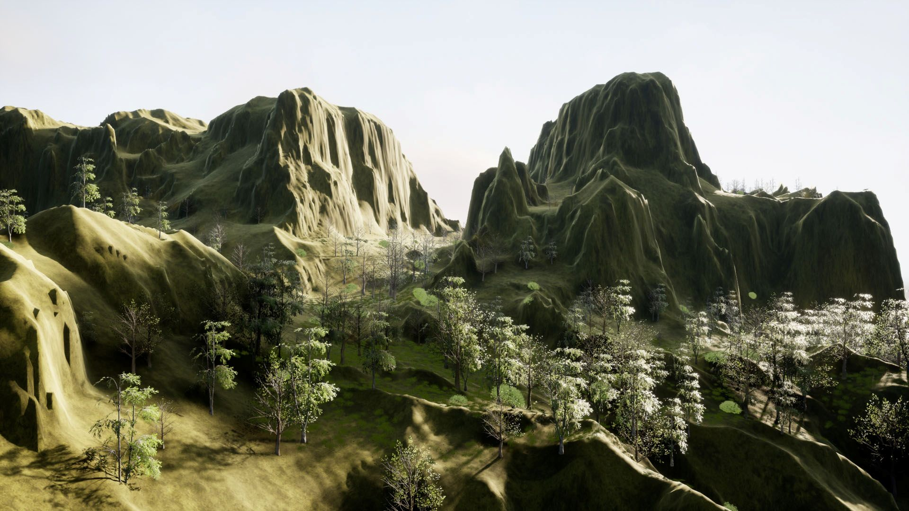

**System Goal**

The **Procedural Forest System** is designed to provide the following
capabilities:

- **Environment-Driven Vegetation Distribution**\
  Distribute trees, bushes, and grass according to environmental
  conditions.

- **Vegetation Hierarchy**\
  Define the generation order and dependencies between vegetation
  layers, from trees to bushes and from bushes to grass.

- **Vegetation Interaction**\
  Control spatial interactions between vegetation layers, including the
  effects of tree influence on bush and grass growth and bush influence
  on grass growth.

- **Controllable Generation**\
  Provide exposed parameters for controlling vegetation distribution and
  generation behavior.

- **Spatially Conditioned Growth**\
  Control vegetation growth according to terrain-derived environmental
  attributes, including height and slope, as well as procedural humidity
  and custom masks.

  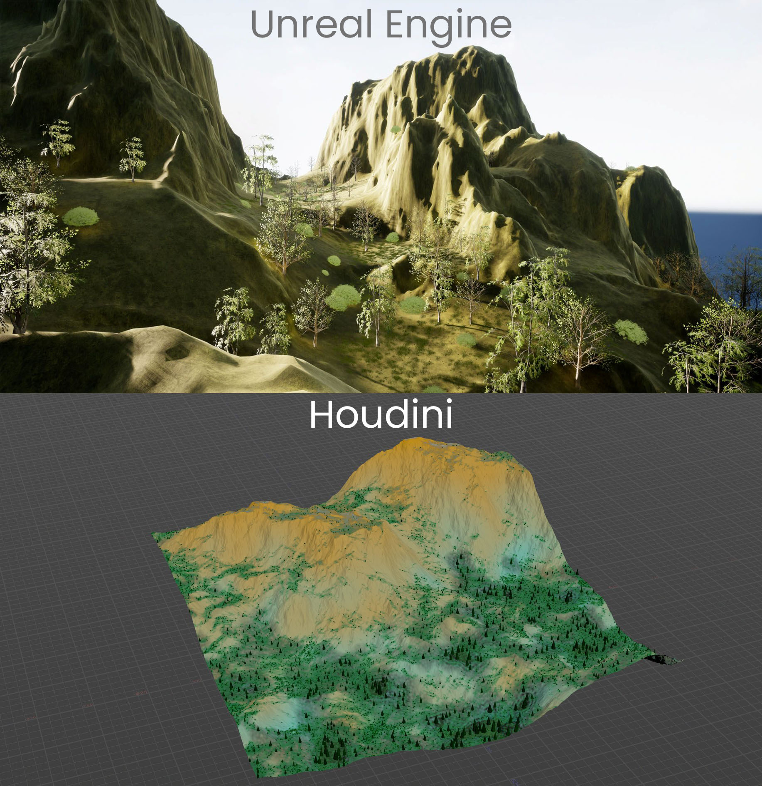

**System Architecture**

The **Procedural Forest System** uses a sequential, dependency-based
architecture in which each major stage provides the data or results
required by subsequent stages.

**Architecture Flow**

            Terrain
               ↓
    Environment Attributes
               ↓
        General Density
               ↓
          Tree Layer     
               ↓
        Tree Influence
               ↓
           Bush Layer
               ↓
         Bush Influence
               ↓
          Grass Layer
               ↓
       Final Vegetation

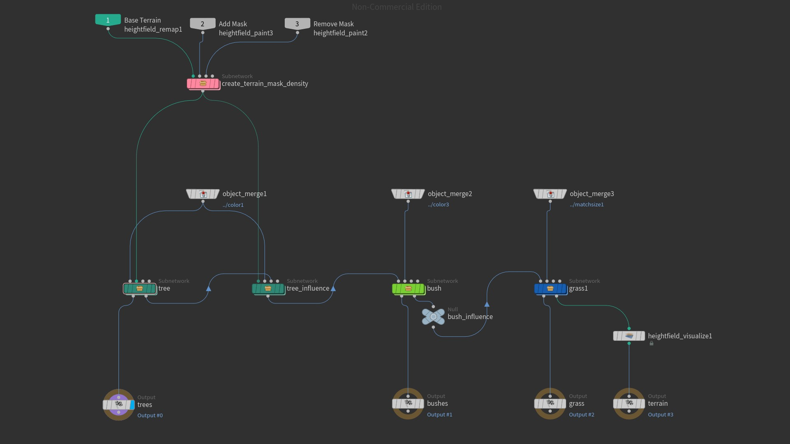

**Architecture Stages**

**1. Terrain**\
Provides the terrain used as the basis for environmental analysis and
vegetation distribution.

**2. Environment Attributes**\
Provides the environmental information used by the vegetation
distribution stages.

**3. General Density**\
Establishes the general vegetation mask used as the basis for the
subsequent vegetation layers.

**4. Tree Layer**\
Generates the tree distribution using the available environmental and
density information.

**5. Tree Influence**\
Generates tree-related influence data used by subsequent vegetation
layers.

**6. Bush Layer**\
Generates the bush distribution using the available density and tree
influence data.

**7. Bush Influence**\
Generates bush-related influence data used by the grass layer.

**8. Grass Layer**\
Generates the grass distribution using the available density and
vegetation influence data.

**9. Final Vegetation**\
Represents the resulting tree, bush, and grass vegetation distributed
across the terrain.

**See**: *Generation process*

**HeightField Visualization** is separate from the core
vegetation-generation architecture. It is a visualization/debugging
stage associated with the output rather than a core
vegetation-generation stage.

Within the documentation, architectural stages such as **Tree Layer**,
**Bush Layer**, and **Grass Layer** correspond to their detailed
generation stages, while **Tree Distribution**, **Bush Distribution**,
and **Grass Distribution** refer to the chronological distribution steps
described in **Generation Process**.

**Environmental Model**

The **Procedural Forest System** uses terrain-derived and procedural
environmental factors to determine general vegetation growth and
suitability across the terrain.

**Environmental Factors**

**Height**

Increasing terrain height decreases general vegetation growth.

height, height_mask, and @height_mask refer to the same terrain-derived
representation. @height_mask has an inverse relationship to terrain
height and is used in the humidity calculation.

**Slope**

Increasing slope decreases general vegetation growth.

slope, slope_mask, and @slope_mask refer to the same HeightField
representation. The slope representation is used in the calculation of
base_density and in the individual vegetation density calculations where
applicable.

**Humidity**

Increasing humidity increases general vegetation growth.

Humidity has an inverse relationship to terrain height and is generated
using procedural noise and @height_mask:

@humidity = noise(@P \* 0.01) \* @height_mask;

Because @height_mask has an inverse relationship to terrain height, it
is directly multiplied in the humidity expression.

**See**: *Attribute Flow*

**Base Density**

base_density represents the general vegetation suitability of the
terrain. It is derived from humidity and slope:

base_density = humidity × (1 - slope)

The resulting base_density is used as the basis for the general
vegetation mask.

**Custom Masks**

Custom masks modify base_density and support two modes:

- **Add & Remove**

- **Overwrite**

**See**: *Vegetation Layers → General Density*

**Tree Influence**

**Tree Influence** is the mechanism through which trees reduce
subsequent vegetation growth.

**See:** *Interaction Model*

**See:** *Generation Process → Tree Influence*

**Bush Influence**

**Bush Influence** is the mechanism through which bushes reduce
subsequent grass growth.

The resulting attribute is bush_influence, which reduces grass growth in
areas affected by bushes.

**See:** *Interaction Model*

**See:** *Generation Process → Bush Influence*

**Vegetation Layers**

This section is the authoritative reference for the layer-specific
generation logic of the **Procedural Forest System**. Each layer is
documented by its inputs, governing rules, density logic, variation, and
output.

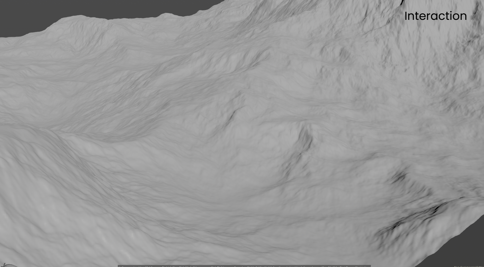

**1. General Density**

The **General Density** layer establishes the general vegetation mask
used by the subsequent vegetation layers.

**Input Data**

- humidity

- slope_mask

- Custom Mask

**Rules**

base_density is derived from humidity and slope. Custom mask operations
then modify base_density to produce density_mask.

**Density Logic**

base_density = humidity × (1 - slope)

density_mask =

base_density

\+ add_mask × (1 - base_density)

\- remove_mask × base_density

***See**: Generation Process → Custom Mask Implementation*

**Variation**

No layer-specific variation is documented for **General Density**.

**Output**

- density_mask

**2. Tree Generation**

The **Tree Generation** layer distributes tree instances using
density_mask and the slope representation.

**Input Data**

- density_mask

- slope_mask

**Rules**

The documented Tree rule applies an additional slope effect to
density_mask through Slope_Density_influence.

**Density Logic**

@density_mask \* pow((1 - @slope_mask), chf("Slope_Density_influence"))

**Variation**

- Point-scale variation through pscale.

**Output**

- Scattered tree instances

**3. Bush Generation**

The **Bush Generation** layer distributes bush instances using
density_mask, the slope representation, tree_influencebush, and
procedural noise.

**Input Data**

- density_mask

- slope_mask

- tree_influencebush

- Noise

**Rules**

Bush growth is reduced by the slope representation and by
tree_influencebush. Procedural noise also contributes to the bush
density.

***See**: Interaction Model*

**Density Logic**

@density_mask

\* pow((1 - @slope_mask), chf("Slope_Density_influence"))

\* noise(@P \* 0.1)

\* (1 - @tree_influencebush)

**Variation**

- Scale variation

**Output**

- Scattered bush instances

**4. Grass Generation**

The **Grass Generation** layer distributes grass instances using
density_mask, tree_influencegrass, bush_influence, and procedural noise.

**Input Data**

- density_mask

- tree_influencegrass

- bush_influence

- Noise

**Rules**

Grass growth is reduced by both tree_influencegrass and bush_influence.

**Grass does not have an additional slope effect in its individual
density formula.** The slope representation contributes to the general
vegetation mask through density_mask, but no additional slope term is
applied in the Grass Generation formula.

**Density Logic**

@density_mask

\* (1 - @tree_influencegrass)

\* (1 - @bush_influence)

\* noise(@P \* 0.1)

**Variation**

- Scale variation

**Output**

- Scattered grass instances

**Interaction Model**

The **Interaction Model** defines the dependencies between vegetation
layers and describes how the distribution of one vegetation layer
affects the density of another.

**Vegetation Dependencies**

The primary vegetation-to-vegetation dependencies are:

         Trees
           ↓
           ├── tree_influencebush → Bush Density → Bushes
           │
           └── tree_influencegrass → Grass Density
        Bushes
           ↓
     bush_influence
           ↓
     Grass Density

Grass Density is therefore affected by both tree_influencegrass and
bush_influence.

**Tree Influence**

**Tree Influence** is the conceptual mechanism through which trees
affect subsequent vegetation layers.

The system does not use a single global tree influence attribute. It
uses two separate attributes:

- tree_influencebush affects **Bush Density**.

- tree_influencegrass affects **Grass Density**.

This separation allows tree influence to affect bushes and grass through
distinct attributes.

The confirmed control expressions are:

tree_influencebush = pow(@mask, chf("bush_power"));

tree_influencegrass = pow(@mask, chf("grass_power"));

\The expressions are applied during the creation of the bush and grass
density masks and define the final control stage for the two tree
influence outputs.

bush_power and grass_power are internal, non-exposed parameters.

**See**: *Generation Process → Tree Influence.*

**Bush Influence**

**Bush Influence** is the mechanism through which bushes affect **Grass
Density**.

The resulting attribute is:

bush_influence

bush_influence reduces grass growth in affected areas.

**See**: *Generation Process → Bush Influence.*

**Dependency Summary**

The complete vegetation interaction structure is:

                         Trees
                           ↓
              ┌────────────┴────────────┐
              │                         │
              ↓                         ↓
     tree_influencebush          tree_influencegrass
              │                         │
              ↓                         ↓
        Bush Density              Grass Density
              │                         │
              ↓                         ↓
            Bushes                    Grass
              │                         ↑
              ↓                         │
       bush_influence ──────────────────┘

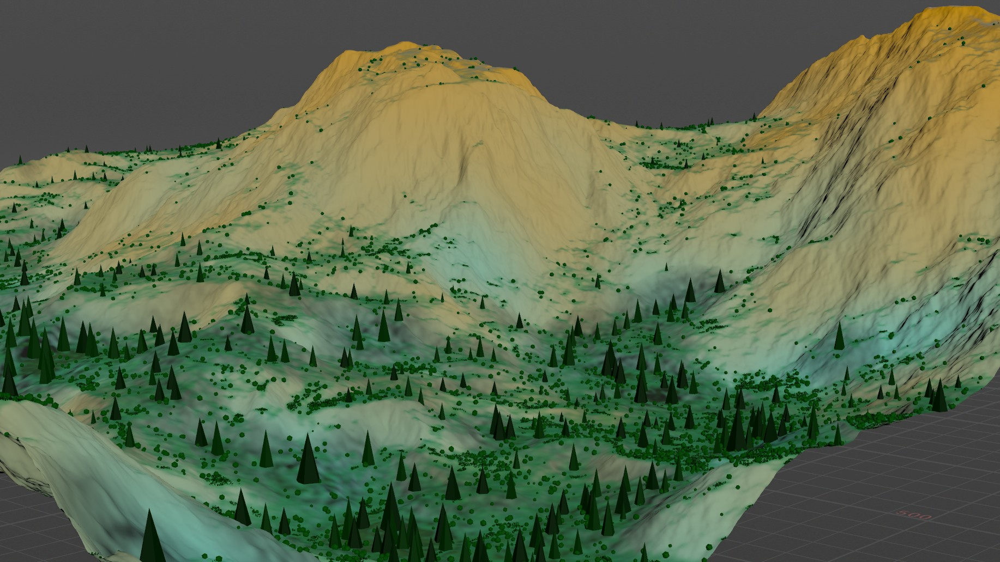

**Attribute Flow**

The **Attribute Flow** defines the lifecycle of the system’s primary
terrain, environmental, density, and influence attributes. It identifies
where each attribute is generated and how it is used by subsequent
stages.

| **Attribute** | **Generated At** | **Used By / Purpose** |
|----|----|----|
| height / height_mask / @height_mask | Generated from the terrain | Used to generate humidity. These identifiers refer to the same terrain-derived representation. @height_mask has an inverse relationship to terrain height. |
| slope / slope_mask / @slope_mask | Generated from the terrain | Used to calculate base_density and for layer-specific slope processing where applicable. These identifiers refer to the same HeightField representation. |
| humidity | Generated using procedural noise and @height_mask | Used with slope to calculate base_density. |
| base_density | Generated from humidity and slope | Modified by custom mask operations to produce density_mask. |
| density_mask | Generated from base_density and custom mask operations | Used as the general vegetation mask for subsequent vegetation density calculations. |
| tree_density | Generated before tree scattering | Used to distribute tree instances. |
| tree_influencebush | Generated from the tree scatter | Used by Bush Density to reduce bush growth in tree-influenced areas. |
| tree_influencegrass | Generated from the tree scatter | Used by Grass Density to reduce grass growth in tree-influenced areas. |
| bush_density | Generated before bush scattering | Used to distribute bush instances. |
| bush_influence | Generated from the bush scatter | Used by Grass Density to reduce grass growth in bush-influenced areas. |
| grass_density | Generated before grass scattering | Used to distribute grass instances. |

**User Controls(Parameters)**

The **User Controls** section defines the exposed parameters used to
control terrain processing, custom mask processing, and vegetation
generation. Parameter behavior is documented separately from the
generated density and influence attributes.

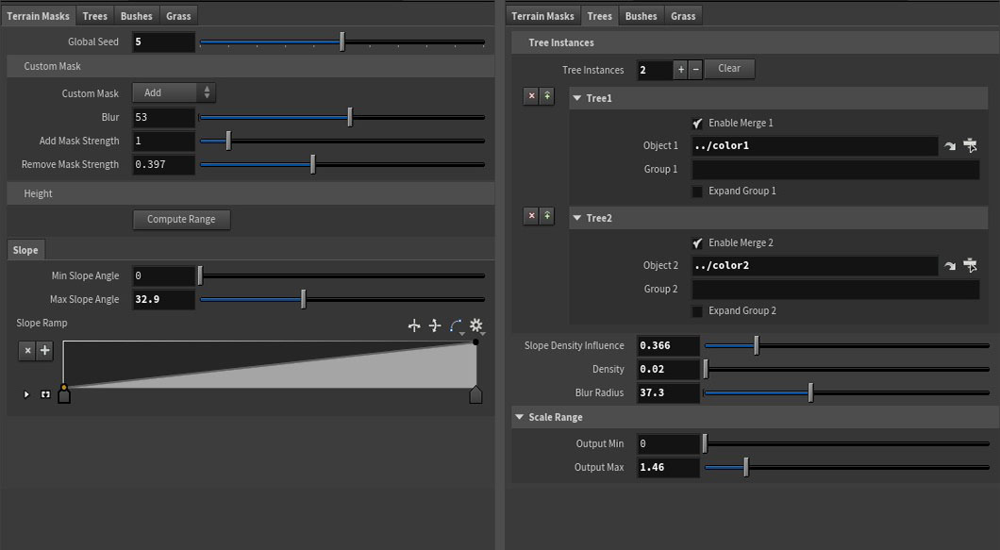  

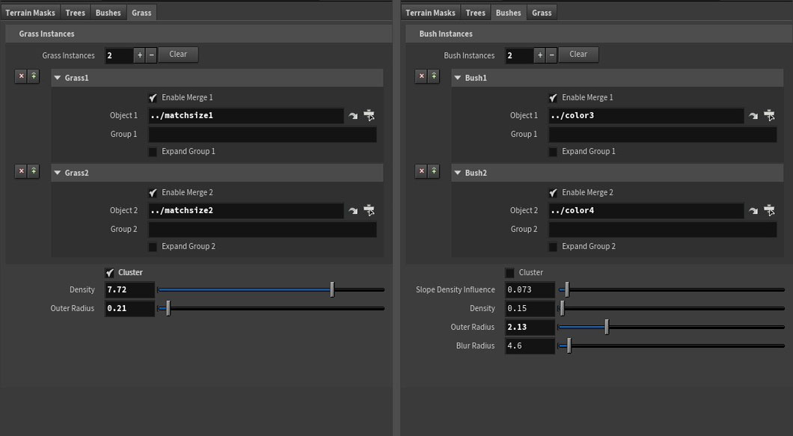

**Terrain**

<table>
<colgroup>
<col style="width: 22%" />
<col style="width: 77%" />
</colgroup>
<thead>
<tr>
<th><strong>Parameter</strong></th>
<th><strong>Documented Behavior</strong></th>
</tr>
</thead>
<tbody>
<tr>
<td><strong>Global Seed</strong></td>
<td>Controls the global seed used by the system.</td>
</tr>
<tr>
<td><strong>Custom Mask Mode</strong></td>
<td>
Selects the custom mask operation. Available modes are
<strong>Add &amp; Remove</strong> and <strong>Overwrite</strong>.

<strong>See</strong>: <em>Generation Process → Custom Mask
Implementation.</em>
</td>
</tr>
<tr>
<td><strong>Blur</strong></td>
<td>Controls the blur applied to the custom masks.</td>
</tr>
<tr>
<td><strong>Add Mask Strength</strong></td>
<td>
Controls the strength of the additive custom mask.

<strong>See</strong>: <em>Vegetation Layers → General
Density</em>
</td>
</tr>
<tr>
<td><strong>Remove Mask Strength</strong></td>
<td>Controls the strength of the subtractive custom mask.</td>
</tr>
<tr>
<td><strong>Compute Range</strong></td>
<td>Button that computes the terrain for the height mask.</td>
</tr>
<tr>
<td><strong>Min Slope Angle</strong></td>
<td>Defines the minimum slope angle used by the slope calculation.</td>
</tr>
<tr>
<td><strong>Max Slope Angle</strong></td>
<td>Defines the maximum slope angle used by the slope calculation.</td>
</tr>
<tr>
<td><strong>Slope Ramp</strong></td>
<td>Controls the slope mask using a ramp.</td>
</tr>
</tbody>
</table>

**Tree**

<table>
<colgroup>
<col style="width: 17%" />
<col style="width: 82%" />
</colgroup>
<thead>
<tr>
<th><strong>Parameter</strong></th>
<th><strong>Documented Behavior</strong></th>
</tr>
</thead>
<tbody>
<tr>
<td><strong>Tree Instances</strong></td>
<td>Exposed geometry parameter through which tree geometry is added for
use as tree instances during tree distribution.</td>
</tr>
<tr>
<td><strong>Slope Density Influence</strong></td>
<td>Controls the additional effect of slope on tree density and is used
through chf("Slope_Density_influence") in the Tree Generation density
expression.</td>
</tr>
<tr>
<td><strong>Density</strong></td>
<td>Defines the number of points per square meter to generate in the
tree scatter. This <strong>Density</strong> parameter is distinct from
the generated tree_density attribute.</td>
</tr>
<tr>
<td><strong>Blur Radius</strong></td>
<td>
Controls blur for both tree influence masks.

<strong>See</strong>: <em>Generation Process → Tree
Influence</em>
</td>
</tr>
<tr>
<td><strong>Scale Range</strong></td>
<td>
Defines the scale range used for tree generation.

<em><strong>See</strong>: Generation Process → Tree
Distribution</em>
</td>
</tr>
<tr>
<td><strong>Output Min</strong></td>
<td>Defines the minimum value used to remap pscale.</td>
</tr>
<tr>
<td><strong>Output Max</strong></td>
<td>
Defines the maximum value used to remap pscale.

<strong>Output Min</strong> and <strong>Output Max</strong> define
the minimum and maximum values used to remap pscale.
</td>
</tr>
</tbody>
</table>

**Bush**

<table>
<colgroup>
<col style="width: 21%" />
<col style="width: 78%" />
</colgroup>
<thead>
<tr>
<th><strong>Parameter</strong></th>
<th><strong>Documented Behavior</strong></th>
</tr>
</thead>
<tbody>
<tr>
<td><strong>Bush Instances</strong></td>
<td>Exposed geometry parameter through which bush geometry is added for
use as bush instances during bush distribution</td>
</tr>
<tr>
<td><strong>Cluster</strong></td>
<td>Toggle that enables or disables clustering. When clustering is
disabled, a secondary point-separation step pushes points away from one
another to prevent clumping. 
<strong>See</strong>: <em>Generation Process → Bush
Distribution</em></td>
</tr>
<tr>
<td><strong>Slope Density Influence</strong></td>
<td>Controls the additional effect of slope on bush density and is used
through chf("Slope_Density_influence") in the Bush Generation density
expression.</td>
</tr>
<tr>
<td><strong>Density</strong></td>
<td>Defines the number of points per square meter to generate in the
bush scatter. This <strong>Density</strong> parameter is distinct from
the generated bush_density attribute.</td>
</tr>
<tr>
<td><strong>Outer Radius (Instances Distance)</strong></td>
<td>An internal parameter exposed as an HDA parameter. It defines the
radius from the point origin considered to be the physical area occupied
by the points.</td>
</tr>
<tr>
<td><strong>Blur Radius</strong></td>
<td>Controls bush_influence. 
<strong>See</strong>: <em>Generation Process → Bush Influence</em></td>
</tr>
</tbody>
</table>

Jitter is also used during bush_influence generation, but it is a
fixed/internal parameter and is not exposed.

**Grass**

<table>
<colgroup>
<col style="width: 23%" />
<col style="width: 76%" />
</colgroup>
<thead>
<tr>
<th><strong>Parameter</strong></th>
<th><strong>Documented Behavior</strong></th>
</tr>
</thead>
<tbody>
<tr>
<td><strong>Grass Instances</strong></td>
<td>Exposed geometry parameter through which grass geometry is added for
use as grass instances during grass distribution.</td>
</tr>
<tr>
<td><strong>Cluster</strong></td>
<td>
Toggle that enables or disables clustering. When clustering is
disabled, a secondary point-separation step pushes points away from one
another.

<strong>See</strong>: <em>Generation Process → Grass
Distribution</em>
</td>
</tr>
<tr>
<td><strong>Density</strong></td>
<td>Defines the number of points per square meter to generate in the
grass scatter. This <strong>Density</strong> parameter is distinct from
the generated grass_density attribute.</td>
</tr>
<tr>
<td><strong>Outer Radius (Instances Distance)</strong></td>
<td>An internal parameter exposed as an HDA parameter. It defines the
radius from the point origin considered to be the physical area occupied
by the points.</td>
</tr>
</tbody>
</table>

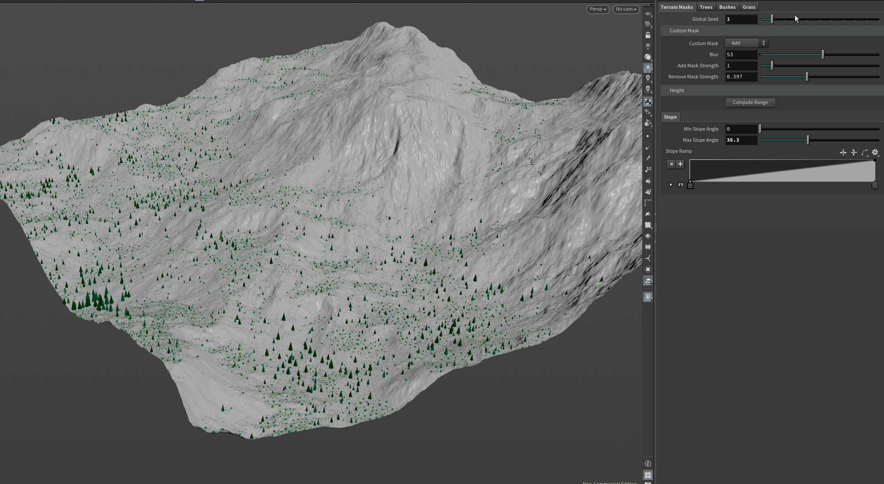

**Parameter and Attribute Distinction**

The **Density** parameters specify the number of points per square meter
in their respective scatter stages. They are distinct from the generated
procedural density attributes:

- **Tree Density parameter** → tree_density

- **Bush Density parameter** → bush_density

- **Grass Density parameter** → grass_density

No separate mathematical conversion between the Density parameters and
these procedural attributes is documented.

**Debug / Visualization**

Available only for Houdini

- density

- slope

- humidity

- tree influence

- tree density

- bush density

- grass density

**Generation Process**

The **Generation Process** defines the chronological implementation
workflow of the Procedural Forest System. The system processes terrain,
environmental data, vegetation layers, and vegetation influence in the
following order:

       Terrain Analysis
              ↓
    Environmental Conditions
              ↓
      Tree Distribution
              ↓
       Tree Influence
              ↓
       Bush Distribution
              ↓
        Bush Influence
              ↓
     Grass Distribution
              ↓
    HeightField Visualizatio

**1. Terrain Analysis**

The system creates the terrain-derived **height** and **slope** masks.

The following identifiers refer to the same terrain-derived
representation:

- height

- height_mask

- @height_mask

The following identifiers refer to the same HeightField/attribute
representation:

- slope

- slope_mask

- @slope_mask

**2. Environmental Conditions**

The system generates humidity from procedural noise and the
terrain-derived @height_mask:

@humidity = noise(@P \* 0.01) \* @height_mask;

@height_mask has an inverse relationship to terrain height, which is
reflected in the humidity calculation.

The system then generates the general vegetation mask from humidity and
slope and applies the configured custom-mask operations. This produces
base_density and subsequently density_mask.

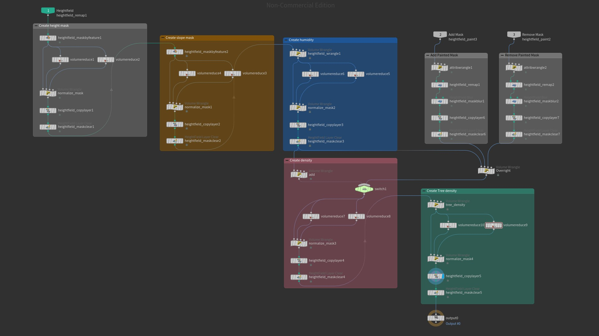

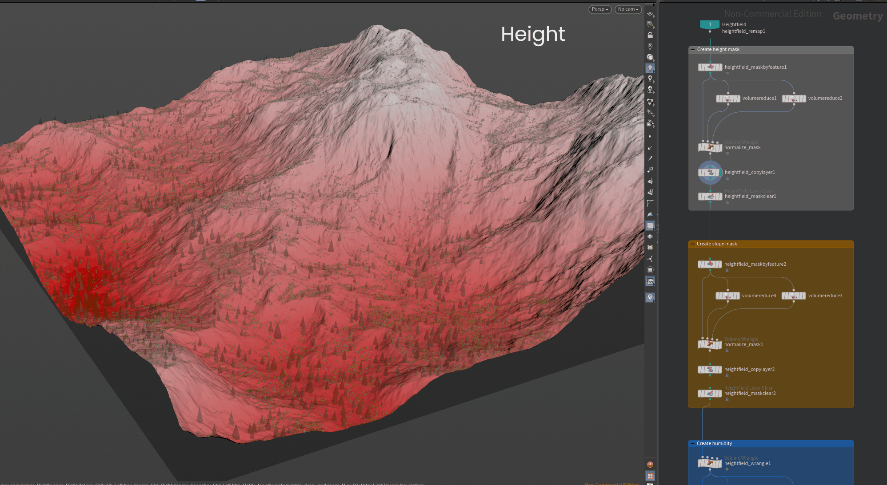

**3. Custom Mask Implementation**

Custom masks support two operation modes:

- **Overwrite**

- **Add & Remove**

The system inputs used by the custom-mask sampling are:

- **First input:** Terrain

- **Second input:** Add/overwrite mask

- **Third input:** Remove mask

The second and third inputs can receive user-provided masks, including
painted masks.

**Overwrite**

volumesample(1, "add_mask", @P) -

volumesample(2, "remove_mask", @P) \*

(volumesample(1, "add_mask", @P));

**Add/Remove**

base_density +

volumesample(1, "add_mask", @P) \*

(1 - base_density) -

volumesample(2, "remove_mask", @P) \*

(base_density);

These operations produce the resulting density_mask.

**See**: *Vegetation Layers → General Density*

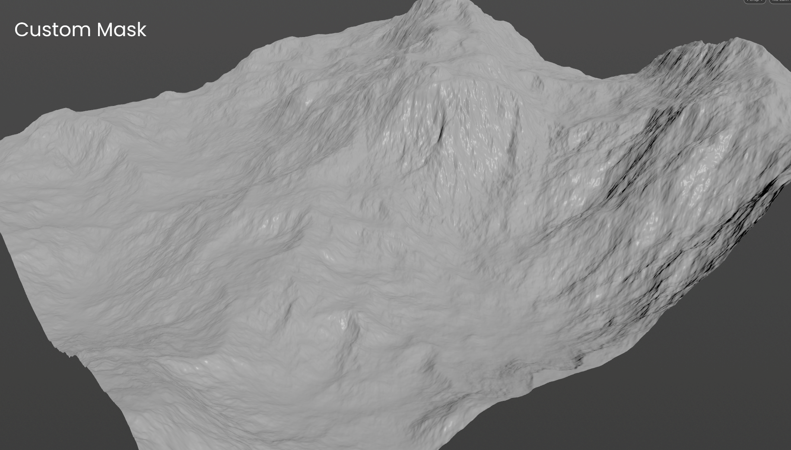

**4. Tree Density**

The system generates tree_density by applying the additional slope
effect defined for tree generation to the general density.

The **tree Density** parameter controls the number of points per square
meter generated by the relevant tree scatter node. The additional slope
effect is controlled through Slope Density Influence.

**5. Tree Distribution**

Tree points are scattered across the terrain using tree_density.

Point-scale variation is applied through pscale. The pscale value is
remapped between **Output Min** and **Output Max** before being applied
to the tree instances.

**See**: *Vegetation Layers → Tree Generation*

**6. Tree Influence**

After tree distribution, an additional random value is applied to the
pscale of each scattered tree point. This randomly increases the scale
used for the tree influence calculation.

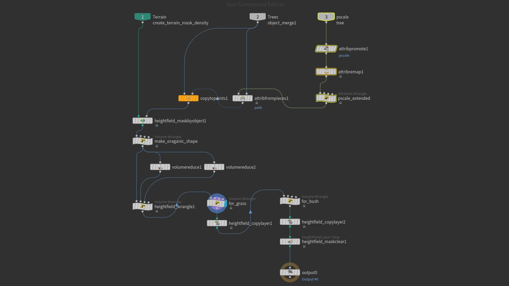

The tree influence mask is generated from the modified tree points,
procedural noise, and a wave-shaped falloff ramp.

The resulting influence is split into two separate HeightField layers:

- tree_influencegrass

- tree_influencebush

During creation of the bush and grass density masks, the corresponding
tree influence is controlled using:

tree_influencebush = pow(@mask, chf("bush_power"));

tree_influencegrass = pow(@mask, chf("grass_power"));

These expressions are applied during the creation of the bush and grass
density masks and define the final control stage for the two tree
influence outputs.

bush_power and grass_power are internal, non-exposed parameters.

**Tree Blur Radius** controls blur for both tree influence masks.

**7. Bush Distribution**

The system generates bush density using:

- General density

- tree_influencebush

- Additional controllable slope influence

- Procedural noise

Bush points are then scattered across the terrain using bush_density.
Scale variation is applied to the scattered points, and the input bush
geometry is instantiated on the generated points.

The **Cluster** parameter controls clustering:

- When **Cluster** is enabled, the distribution uses clustered
  placement.

- When **Cluster** is disabled, a secondary point-separation step pushes
  points away from one another to prevent clumping.

**Outer Radius (Instances Distance)** is used during bush point
distribution.

**8. Bush Influence**

The scattered bushes are used to create bush_influence.

Blur and jitter are applied during this process. **Bush Blur Radius**
controls bush_influence.

Jitter is a fixed/internal parameter and is not exposed.

The resulting influence is stored as the HeightField layer:

bush_influence

**9. Grass Distribution**

The system generates grass density using:

- density_mask

- tree_influencegrass

- bush_influence

- Procedural noise

Grass points are then scattered across the terrain using grass_density.
Scale variation is applied to the scattered points, and the input grass
geometry is instantiated on the generated points.

The **Cluster** parameter controls clustering. When **Cluster** is
disabled, a secondary point-separation step pushes points away from one
another.

**Outer Radius (Instances Distance)** is used during grass point
distribution.

Grass does **not** have an additional slope effect in its individual
density formula. The slope representation affects the general vegetation
mask through density_mask, but no additional slope term is applied in
the Grass Generation formula.

**See**: *Vegetation Layers → Grass Generation*

**10. HeightField Visualization**

A **HeightField Visualize** node is used at the end of the process to
visualize different HeightField layers on the output terrain.

This is a separate visualization/debugging operation rather than a core
vegetation-generation stage. It does not modify the final vegetation and
is provided as a separate output.

**Input**

The **Input and Output** section defines the external interface of the
**Procedural Forest System**, including the required terrain and mask
inputs, system-level vegetation geometry inputs, and generated outputs.

**Inputs**

The system accepts the following inputs in this order:

| **Input** | **Description** |
|----|----|
| **1. Terrain** | Required HeightField / voxel-based terrain input used as the basis for terrain analysis and vegetation distribution. |
| **2. Add/Overwrite Mask** | User-provided mask input used by the custom-mask workflows. The mask can be a painted mask and is used for the **Add & Remove** and **Overwrite** operations. |
| **3. Remove Mask** | User-provided mask input used by the custom-mask workflows. The mask can be a painted mask. |

The system also uses the following system-level vegetation geometry
inputs:

| **Geometry Input** | **Description**                                    |
|--------------------|----------------------------------------------------|
| **Tree Geometry**  | Tree geometry used for tree instance generation.   |
| **Bush Geometry**  | Bush geometry used for bush instance generation.   |
| **Grass Geometry** | Grass geometry used for grass instance generation. |

**Tree Geometry**, **Bush Geometry**, and **Grass Geometry** are
system-level input terminology. The corresponding exposed HDA parameters
are **Tree Instances**, **Bush Instances**, and **Grass Instances**. The
user adds the geometries through these exposed parameters, and the
supplied geometries are used as instances during scatter distribution.

**Outputs**

| **Output** | **Description** |
|------------|-----------------|

| **Scattered Trees** | Generated tree instances distributed across the terrain. |
|----|----|

| **Scattered Bushes** | Generated bush instances distributed across the terrain. |
|----|----|

| **Scattered Grass** | Generated grass instances distributed across the terrain. |
|----|----|

| **Visualized Terrain** | Output terrain associated with the separate debug/visualization operation using the **HeightField Visualize** node. This visualization does not modify the final vegetation. |
|----|----|

**Results / Examples**

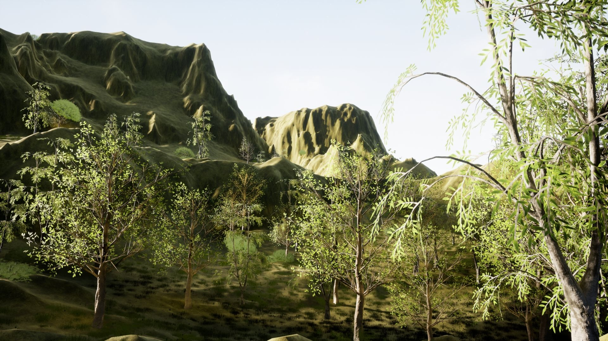
  
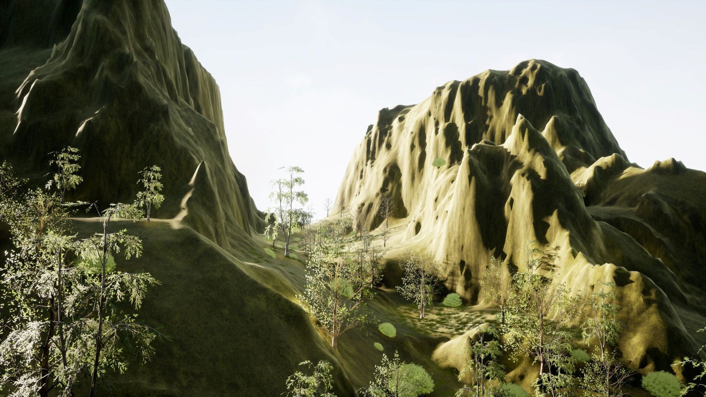

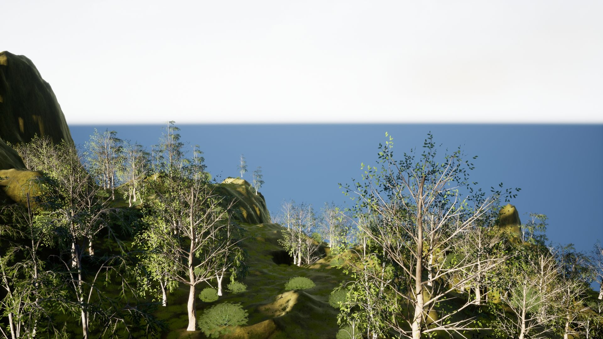
  
**Performance**

Performance depends on terrain resolution, terrain size, vegetation
density, and the number of generated instances.

No formal performance benchmarking has been performed for the current
version.

**Unreal Integration**

The **Procedural Forest System** has been tested with:

- **Houdini:** 20.0.547

- **Unreal Engine:** 5.2.1

The system can be integrated into Unreal Engine through Houdini Engine.

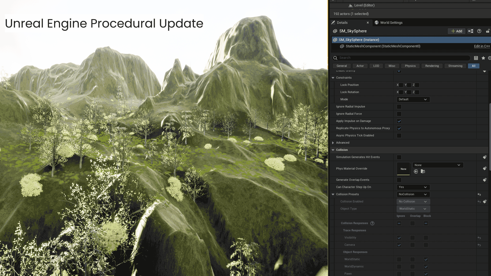

**Integration Notes**

**Input Mesh Pivot Convention**

When multiple different meshes are provided as instances for the same
vegetation layer, their pivots/origins should follow a consistent
ground-relative convention.

This ensures that the different instance meshes are correctly aligned to
the terrain surface when distributed in Unreal Engine.

**Large Terrain Inputs**

Very large terrain inputs may not be handled reliably during Unreal
Engine integration and can result in instability or application crashes
depending on terrain size, scene complexity, and available system
resources.

**Requirements**

• Houdini Apprentice or higher license.

• Houdini version: Houdini Version 20.0.547

Unreal Engine integration requires Houdini Engine compatibility and an
appropriate Houdini Engine license.

Houdini Apprentice is intended for learning and non-commercial workflows
and does not support a full Houdini Engine production pipeline.

**Limitations**

**Humidity** is a procedural approximation derived from terrain height
and noise rather than a physically simulated environmental factor.

**Known Issues**

No known reproducible issues were identified within the tested Houdini
workflow.

Unreal Engine integration limitations related to input mesh pivot
conventions and very large terrain inputs are documented under **Unreal
Integration**.

**Future Improvements / Roadmap**

- Species-specific vegetation rules

- Seasonal variation

- Sunlight / shade-based vegetation behavior

- Water proximity and moisture-based distribution

- More advanced vegetation competition

- Unreal Engine PCG integration

**Changelog**

Version 1.0.0

- Environment-driven vegetation distribution

- Tree, bush, and grass generation

- Tree-to-vegetation spatial influence

- Bush-to-grass spatial influence

- Custom mask workflows

- Houdini Engine integration testing with Unreal Engine 5.2.1

**License**

This tool is provided for non-commercial, educational, and personal
use.\
The Procedural Forest System was developed using Houdini Apprentice and
is distributed as a non-commercial Houdini Digital Asset (.hdanc).

**Credits**

**Tool Development**\
Mina D.

**Documentation**\
Mina D.

**Software**

- Houdini FX 20.0.547

- Unreal Engine 5.2.1

**Development Assistance**

AI-assisted learning and documentation workflow support provided through
OpenAI ChatGPT.

**Document Information**

Author: Mina D.

Version: 1.0.0

Last Updated: September 2026

License: Non-commercial (.hdanc)

**Integration Testing**

- Houdini FX 20.0.547

- Unreal Engine 5.2.1
